# Personal Information MCP Server - Product Requirements Document

## 1. Project Overview

### 1.1 Vision
Build a secure, permission-based Model Context Protocol (MCP) server in TypeScript that manages personal information with granular access control and file-based storage.

### 1.2 Goals
- Create a TypeScript MCP server that integrates with Claude Desktop and other MCP-compatible clients
- Implement a robust permission-based scoping system for data access
- Store personal information in organized markdown files
- Provide tools for getting, saving, updating, and managing personal data
- Ensure data privacy and security through scope-based access control

### 1.3 Target Users
- Individuals who want to manage their personal information through AI assistants
- Developers building personal AI workflows
- Privacy-conscious users who need granular control over data sharing

## 2. Technical Requirements

### 2.1 Core Technologies
- **Runtime**: Node.js 18+
- **Language**: TypeScript 5.0+
- **MCP Framework**: @modelcontextprotocol/sdk
- **Package Manager**: npm
- **Storage**: File-based (Markdown files)
- **Validation**: Zod for schema validation

### 2.2 Dependencies
```json
{
  "dependencies": {
    "@modelcontextprotocol/sdk": "^latest",
    "zod": "^3.22.0",
    "fs-extra": "^11.2.0",
    "yaml": "^2.3.0",
    "glob": "^10.3.0"
  },
  "devDependencies": {
    "typescript": "^5.0.0",
    "@types/node": "^20.0.0",
    "@types/fs-extra": "^11.0.0"
  }
}
```

## 3. Architecture Design

### 3.1 High-Level Architecture

```mermaid
graph TB
    A[MCP Client] -->|MCP Protocol| B[Personal Info MCP Server]
    B --> C[Permission Manager]
    B --> D[File Manager]
    B --> E[Data Validator]
    
    C --> F[Scope Checker]
    C --> G[Permission Store]
    
    D --> H[Markdown Files]
    D --> I[File Operations]
    
    E --> J[Schema Validation]
    E --> K[Data Sanitization]
    
    H --> L[public/]
    H --> M[contact/]
    H --> N[location/]
    H --> O[personal/]
    H --> P[sensitive/]
```



### 3.2 Data Flow


## 4. Permission System

### 4.1 Scope Definitions

#### 4.1.1 Built-in Scopes

| Scope | Description | Sensitivity Level | Example Data |
|-------|-------------|-------------------|--------------|
| `public` | Publicly shareable information | 1 | Name, avatar, bio |
| `contact` | Contact information | 3 | Email, phone, social media |
| `location` | Location-based data | 5 | Address, current location, places |
| `personal` | Personal details | 6 | Age, hobbies, preferences |
| `memories` | Personal memories and experiences | 7 | Trips, events, relationships |
| `sensitive` | Sensitive information | 9 | Health data, financial info |

#### 4.1.2 Custom Scopes

Users can create custom scopes for specialized information categories:

**Examples:**
- `work` (level 4): Professional information, projects, colleagues
- `health` (level 8): Medical records, fitness data, mental health notes  
- `financial` (level 9): Banking, investments, insurance
- `family` (level 6): Family member details, relationships, events
- `hobbies_photography` (level 2): Photography projects, techniques, equipment

**Custom Scope Storage:**
Custom scopes are defined in `data/.scopes/custom-scopes.json`:
```json
{
  "work": {
    "description": "Professional information and work-related data",
    "sensitivity_level": 4,
    "parent_scope": "personal",
    "created": "2024-01-15T10:30:00Z"
  },
  "health": {
    "description": "Health and medical information",
    "sensitivity_level": 8,
    "parent_scope": "sensitive",
    "created": "2024-01-16T14:20:00Z"
  }
}
```

### 4.2 Permission Hierarchy


### 4.3 Scope-Based File Access

Files will be filtered based on the requested scope combination:
- Request with `public` scope: Access only files with `scope: public`
- Request with `public,contact` scope: Access files with `scope: public` OR `scope: contact`
- Request with `public,contact,location` scope: Access files with any of these scopes
- Request with `all` scope: Access files with any scope (equivalent to all individual scopes)

**Implementation Note**: The `all` scope should be resolved at startup to the full list of available scopes: `["public", "contact", "location", "personal", "memories", "sensitive"]`

## 5. File Management System

### 5.1 File Structure
```
data/
├── .scopes/
│   └── custom-scopes.json         # Custom scope definitions
├── public/
│   ├── name.md
│   ├── avatar.md
│   └── bio.md
├── contact/
│   ├── phone-personal-mobile.md
│   ├── phone-work.md
│   ├── email-personal.md
│   └── email-work.md
├── location/
│   ├── address-home.md
│   ├── address-work.md
│   └── current-location.md
├── personal/
│   ├── age.md
│   ├── hobbies.md
│   └── preferences.md
├── memories/
│   ├── trip-japan-2023.md
│   ├── graduation-2020.md
│   └── relationships.md
├── sensitive/
│   ├── health-allergies.md
│   └── financial-bank.md
├── work/                          # Custom scope example
│   ├── current-project.md
│   ├── colleagues.md
│   └── meeting-notes-2024.md
└── health/                        # Custom scope example
    ├── medications.md
    ├── allergies.md
    └── fitness-goals.md
```

### 5.2 File Format

Each markdown file follows this structure:

```markdown
---
scope: contact
category: phone
subcategory: personal-mobile
created: 2024-01-15T10:30:00Z
updated: 2024-01-15T10:30:00Z
tags: [contact, mobile, primary]
---

# Phone - Personal Mobile

+1 (555) 123-4567

## Notes
- Primary contact number
- Available 9 AM - 10 PM PST
- Supports text messages
```

### 5.3 Naming Convention

Format: `{category}-{subcategory}-{identifier}.md`

Examples:
- `phone-personal-mobile.md`
- `address-home.md`
- `trip-japan-2023.md`
- `email-work-primary.md`

## 6. API Specifications

### 6.1 MCP Tools

#### 6.1.1 get_personal_info
```typescript
{
  name: "get_personal_info",
  description: "Retrieve personal information based on category and current scope permissions",
  inputSchema: {
    type: "object",
    properties: {
      category: {
        type: "string",
        description: "Category of information to retrieve (e.g., 'phone', 'address', 'hobbies')"
      },
      subcategory: {
        type: "string", 
        description: "Optional subcategory filter"
      }
    },
    required: ["category"]
  }
}
```

#### 6.1.2 save_personal_info
```typescript
{
  name: "save_personal_info",
  description: "Save or update personal information",
  inputSchema: {
    type: "object",
    properties: {
      category: { type: "string" },
      subcategory: { type: "string" },
      content: { type: "string" },
      scope: { 
        type: "string",
        enum: ["public", "contact", "location", "personal", "memories", "sensitive"]
      },
      tags: {
        type: "array",
        items: { type: "string" }
      }
    },
    required: ["category", "content", "scope"]
  }
}
```

#### 6.1.3 list_available_personal_info
```typescript
{
  name: "list_available_personal_info",
  description: "List all available personal information within current scope",
  inputSchema: {
    type: "object",
    properties: {
      scope_filter: {
        type: "string",
        description: "Optional scope filter to narrow results"
      }
    }
  }
}
```

#### 6.1.4 delete_personal_info
```typescript
{
  name: "delete_personal_info",
  description: "Delete specific personal information",
  inputSchema: {
    type: "object",
    properties: {
      category: { type: "string" },
      subcategory: { type: "string" }
    },
    required: ["category"]
  }
}
```

#### 6.1.5 search_personal_memories
```typescript
{
  name: "search_personal_memories",
  description: "Search through memories and experiences",
  inputSchema: {
    type: "object",
    properties: {
      query: { type: "string" },
      tags: {
        type: "array",
        items: { type: "string" }
      },
      date_range: {
        type: "object",
        properties: {
          start: { type: "string", format: "date" },
          end: { type: "string", format: "date" }
        }
      }
    },
    required: ["query"]
  }
}
```

#### 6.1.6 create_personal_scope
```typescript
{
  name: "create_personal_scope",
  description: "Create a new custom scope for organizing personal information",
  inputSchema: {
    type: "object",
    properties: {
      scope_name: {
        type: "string",
        pattern: "^[a-z][a-z0-9_-]*$",
        description: "Name of the new scope (lowercase, alphanumeric, underscores, hyphens)"
      },
      description: {
        type: "string",
        description: "Description of what this scope contains"
      },
      parent_scope: {
        type: "string",
        description: "Optional parent scope for inheritance (e.g., 'personal')"
      },
      sensitivity_level: {
        type: "integer",
        minimum: 1,
        maximum: 10,
        description: "Sensitivity level (1=public, 10=highly sensitive)"
      }
    },
    required: ["scope_name", "description"]
  }
}
```

#### 6.1.7 list_personal_scopes
```typescript
{
  name: "list_personal_scopes",
  description: "List all available scopes (built-in and custom) with their details",
  inputSchema: {
    type: "object",
    properties: {
      include_custom_only: {
        type: "boolean",
        description: "If true, only show custom scopes, exclude built-in ones"
      },
      show_hierarchy: {
        type: "boolean", 
        description: "If true, show scope inheritance hierarchy"
      }
    }
  }
}
```

### 6.2 Server Configuration

#### 6.2.1 Environment Variables
```bash
# Server Configuration
PERSONAL_INFO_DATA_DIR=./data
PERSONAL_INFO_DEFAULT_SCOPE=public
PERSONAL_INFO_MAX_FILE_SIZE=1048576  # 1MB
PERSONAL_INFO_BACKUP_ENABLED=true
PERSONAL_INFO_BACKUP_DIR=./backups

# Security
PERSONAL_INFO_ENCRYPTION_ENABLED=false
PERSONAL_INFO_ENCRYPTION_KEY=""
```

#### 6.2.2 Scope Configuration
Server can be started with specific scope permissions:

```bash
# Public only
npm start -- --scope=public

# Public and contact
npm start -- --scope=public,contact

# Multiple specific scopes
npm start -- --scope=public,contact,location

# All scopes (shorthand)
npm start -- --scope=all
```

**Scope Options:**
- Built-in scopes: `public`, `contact`, `location`, `personal`, `memories`, `sensitive`
- Custom scopes: Any user-defined scopes (e.g., `work`, `health`, `family`)
- Comma-separated combinations: `public,contact,work`
- Special keyword: `all` (equivalent to all built-in and custom scopes)
- Default if no scope specified: `public`

**Examples with custom scopes:**
```bash
# Include a custom scope
npm start -- --scope=public,contact,work

# Mix built-in and custom scopes
npm start -- --scope=personal,health,family
```

## 7. Implementation Plan

### 7.1 Phase 1: Core Infrastructure (Week 1)
- [ ] Set up TypeScript project structure
- [ ] Implement basic MCP server setup
- [ ] Create file management utilities
- [ ] Implement permission system foundation
- [ ] Add basic validation schemas
- [ ] Implement scope parsing logic (including `--scope=all` shorthand)

### 7.2 Phase 2: Basic Tools (Week 2)
- [ ] Implement `get_personal_info` tool
- [ ] Implement `save_personal_info` tool
- [ ] Implement `list_available_personal_info` tool
- [ ] Implement `list_personal_scopes` tool
- [ ] Add file CRUD operations
- [ ] Create scope filtering logic

### 7.3 Phase 3: Advanced Features (Week 3)
- [ ] Implement `delete_personal_info` tool
- [ ] Implement `search_personal_memories` tool
- [ ] Implement `create_personal_scope` tool
- [ ] Add custom scope management and validation
- [ ] Add tag-based searching
- [ ] Implement backup system
- [ ] Add data validation and sanitization

### 7.4 Phase 4: Security & Polish (Week 4)
- [ ] Add optional encryption support
- [ ] Implement rate limiting
- [ ] Add comprehensive error handling
- [ ] Create documentation and examples
- [ ] Add integration tests

## 8. Security Considerations

### 8.1 Data Protection
- All file operations respect scope permissions
- Input validation and sanitization
- Optional file encryption for sensitive data
- Secure file path handling to prevent directory traversal

### 8.2 Access Control
- Scope-based permission system
- No privilege escalation between scopes
- Clear separation of data by scope directories
- Audit logging for sensitive operations

### 8.3 Error Handling
- No sensitive information in error messages
- Graceful handling of permission denied scenarios
- Safe fallbacks for corrupted files
- Proper cleanup of temporary files

## 9. Integration Examples

### 9.1 Claude Desktop Configuration
```json
{
  "mcpServers": {
    "personal-info": {
      "command": "node",
      "args": ["./dist/index.js", "--scope=public,contact"],
      "env": {
        "PERSONAL_INFO_DATA_DIR": "./data",
        "PERSONAL_INFO_DEFAULT_SCOPE": "public"
      }
    },
    "personal-info-full": {
      "command": "node",
      "args": ["./dist/index.js", "--scope=all"],
      "env": {
        "PERSONAL_INFO_DATA_DIR": "./data"
      }
    }
  }
}
```

### 9.2 Usage Examples

**Getting contact information:**
```
User: "What's my phone number?"
Assistant: Uses get_personal_info(category: "phone") → Returns phone numbers accessible in current scope
```

**Saving a memory:**
```
User: "Save that I went to Japan in March 2024 and loved the cherry blossoms"
Assistant: Uses save_personal_info(category: "trip", subcategory: "japan-2024", content: "...", scope: "memories")
```

**Listing available information:**
```
User: "What personal information do you have access to?"
Assistant: Uses list_available_personal_info() → Returns categorized list based on current scope
```

**Creating a custom scope:**
```
User: "Create a scope called 'work' for my professional information"
Assistant: Uses create_personal_scope(scope_name: "work", description: "Professional information and work-related data", sensitivity_level: 4)
```

**Listing all available scopes:**
```
User: "What scopes are available for organizing my information?"
Assistant: Uses list_personal_scopes() → Returns both built-in and custom scopes with descriptions
```

**Using custom scopes:**
```
User: "Save my current project details in the work scope"
Assistant: Uses save_personal_info(category: "project", content: "...", scope: "work")
```

## 10. Future Enhancements

### 10.1 Advanced Features
- AI-powered information extraction from natural language
- Automatic categorization suggestions
- Data synchronization with external services
- Advanced search with semantic similarity
- Data import/export functionality

### 10.2 Integration Possibilities
- Calendar integration for memories
- Contact management system integration
- Photo and document attachment support
- Cloud storage backup options
- Multi-user support with shared scopes

## 11. Success Metrics

- **Functionality**: All core tools working with proper scope enforcement
- **Security**: No data leaks between scopes
- **Performance**: < 100ms response time for file operations
- **Reliability**: 99.9% uptime for file operations
- **Usability**: Clear error messages and intuitive categorization

---

*This PRD serves as the foundation for building a secure, scalable personal information management system using the MCP protocol.* 